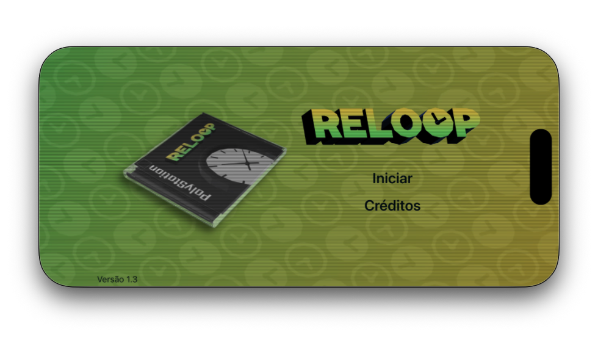
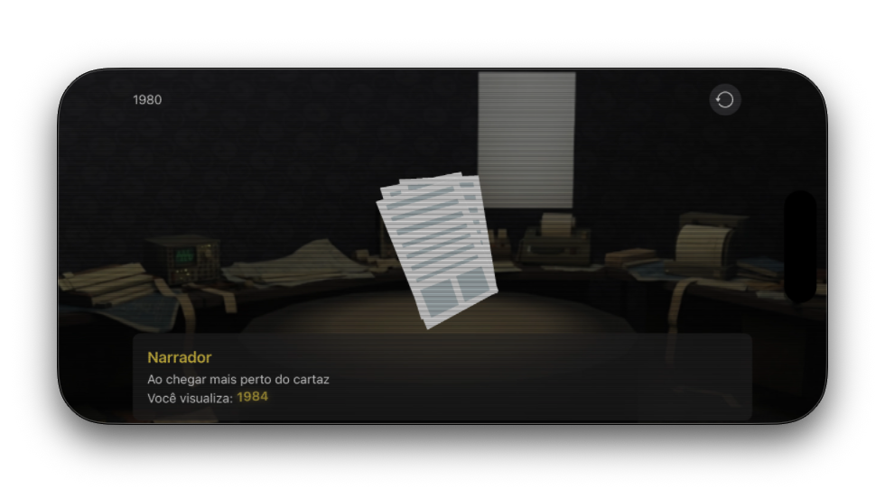

  
  <h3 align="center">ReLoop</h3>
  
An interactive time travel game that uses phone movement to make choices.

---

## Introduction

**ReLoop** is an immersive iOS experience where history repeats itself and memory is a luxury you cannot afford. You wake up disoriented with no recollection of where you were or how you got there. As you navigate through temporal shifts, your choices shape the timeline. 

The catch? Time moves in an endless, looping cycle. Every decision leads you forward, only to pull you right back to the very beginning wiping your memory clean for the next iteration. Using your device's gyroscope, you physically tilt your reality to make critical choices, combining physical interaction with tactile haptic feedback for a truly engaging narrative journey.

  Screenshots

 

    
&nbsp;
    

## Features

- **Gyroscope Navigation:** Tilt your phone physically to explore environments and make pivotal narrative choices.
- **Immersive Haptics:** Built-in accessibility and feedback vibrations that react to your actions in the time loop.
- **3D Interactive Environments:** Integrated 3D models rendered natively in Swift using `SceneKit` and `.usdz` assets.
- **Endless Narrative:** A branching time-travel story with a looping structure.

## Technologies

- **Language:** Swift
- **Frameworks:** SwiftUI, SceneKit
- **Hardware/Sensors:** CoreMotion (Gyroscope), CoreHaptics (Vibration)
- **Assets:** 3D models in `.usdz` format, AI-generated concept imagery

## Credits

A special thanks to the creators and platforms that made this project possible:
- **3D Models:** Sourced from [Poly.pizza](https://poly.pizza/). *(Insert specific author credits here if required by their licenses)*
- **Visual Assets:** Concept and auxiliary imagery generated via Gemini.

## License

The source code of this application is distributed under the [MIT License](LICENSE). 

> **Note:** *The MIT License applies strictly to the source code of this repository. The 3D models, visual assets, and audio elements retain their original individual licenses and creator copyrights.*
